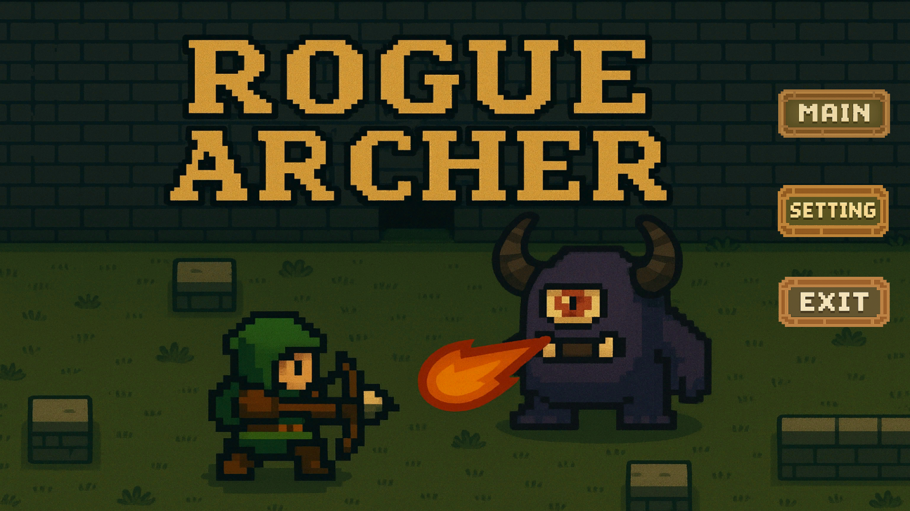
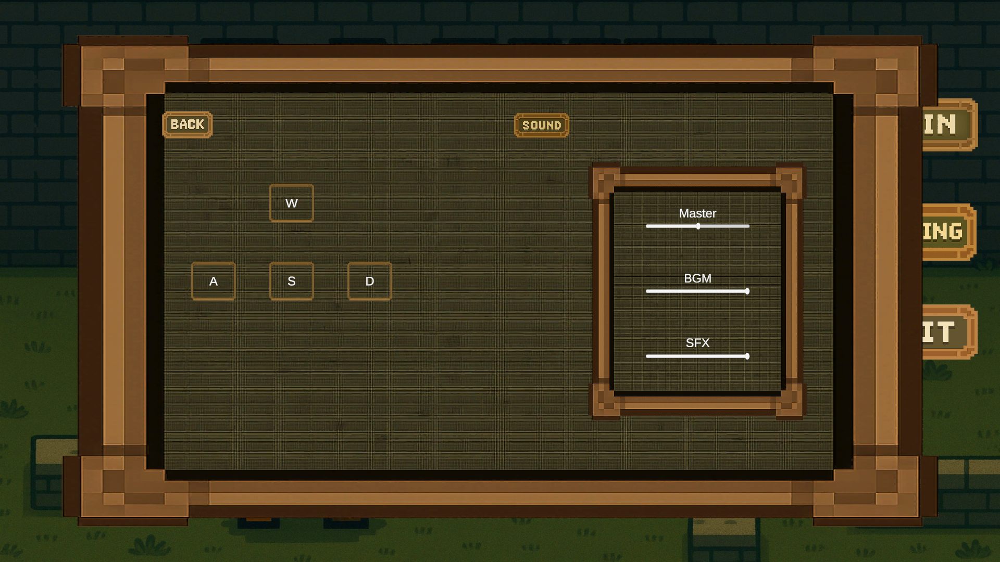
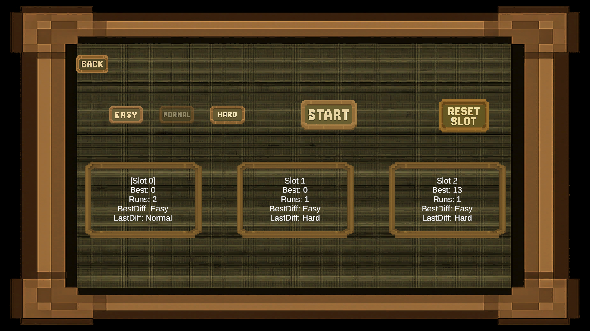
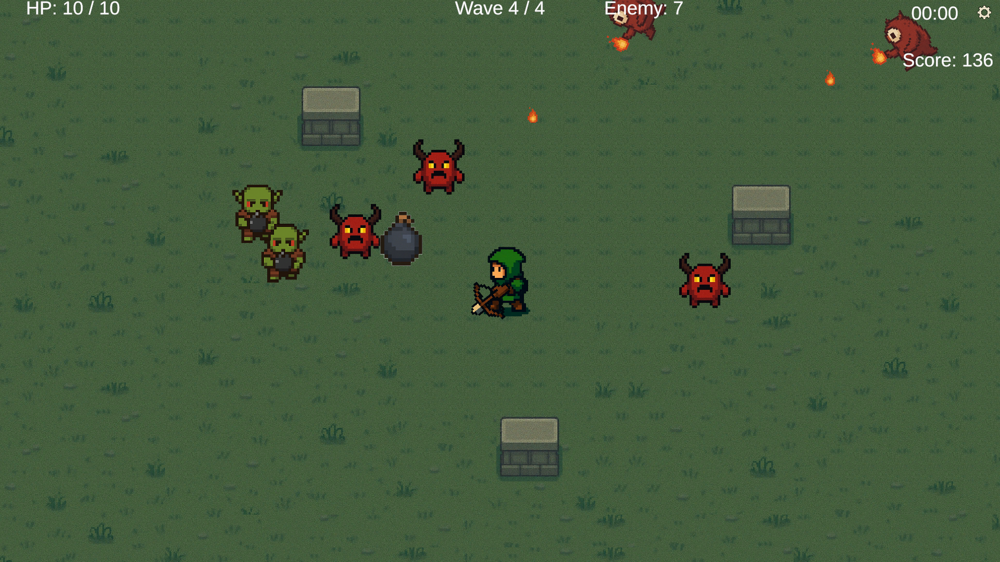
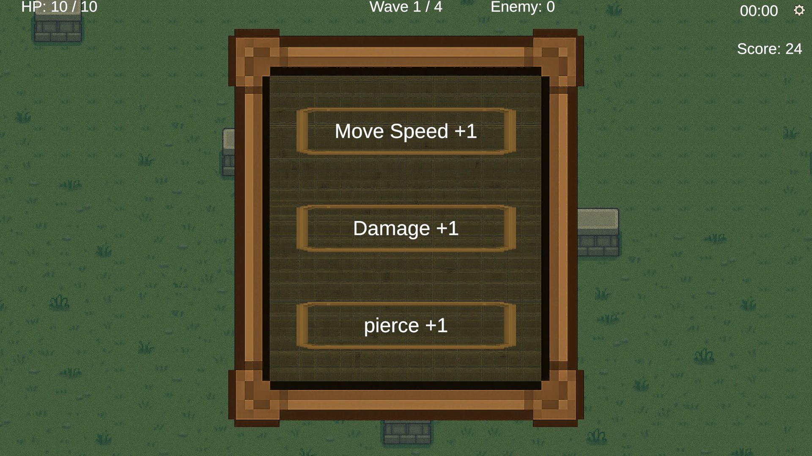
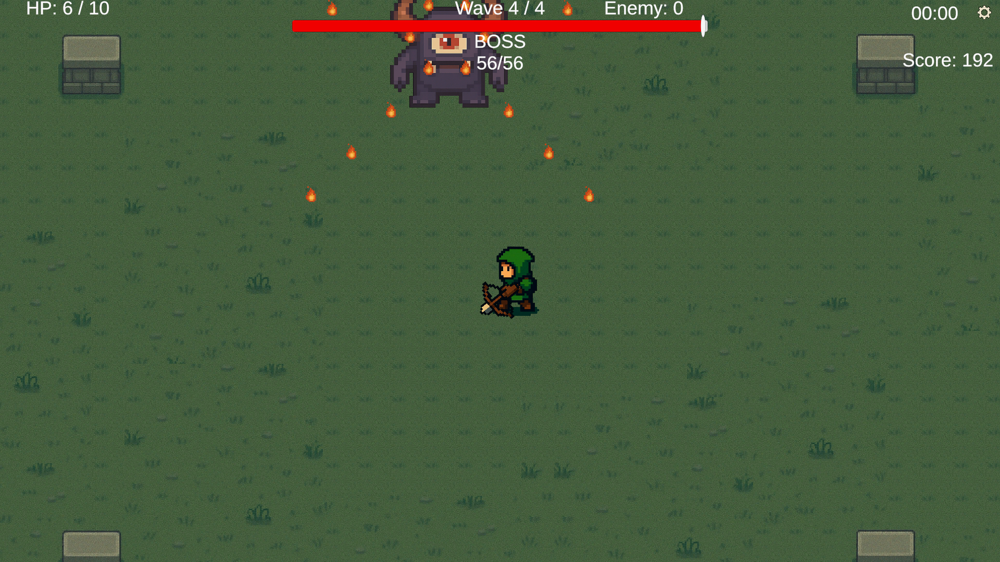
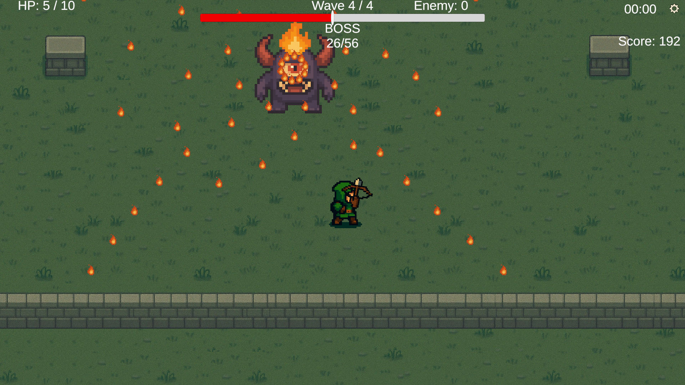

# 🏹 Rogue Archer (2D Top-Down Action Game)

Unity 기반의 **2D 탑다운 로그라이크 액션 게임**입니다.  
웨이브 기반 전투, 난이도 선택, 세이브 슬롯 시스템을 중심으로  
**게임 플레이 완성도와 구조적인 설계**에 집중하여 개발했습니다.

---

## 🧩 Project Overview

- **Engine**: Unity (2D)
- **Language**: C#
- **Platform**: PC (Windows)
- **Genre**: Top-Down Action / Roguelike
- **Development Type**: 1인 개발
  
플레이어는 끊임없이 몰려오는 적을 상대하며  
업그레이드를 선택하고, 보스 웨이브까지 생존하는 것을 목표로 합니다.

---

## ⚔️ Core Features

### ✔ Wave & Difficulty System
- Easy / Normal / Hard 난이도 선택
- 난이도별로 다른 Wave 구성 (적 수 / 등장 타이밍)
- 보스 전용 아레나 전환 및 BGM 변경

### ✔ Enemy AI
- 플레이어 추적 AI
- 폭탄 투척형 Enemy (Bomber)
- 스폰 시 벽/장애물 끼임 방지 로직

### ✔ Player System
- 마우스 방향 기반 공격
- 좌/우 방향에 따른 캐릭터 스프라이트 전환
- 무기 회전 분리 구조 (Body / Weapon 분리)

---

## 💾 Save & Slot System

- **3개의 세이브 슬롯**
- 슬롯별 저장 정보:
  - 최고 점수
  - 플레이 횟수
  - 최고 점수 달성 난이도
  - 마지막 플레이 난이도
- 슬롯 초기화(Reset) 기능 제공
- PlayerPrefs 기반 JSON 저장 구조

---

## 🧠 Upgrade System

- 웨이브 종료 시 랜덤 업그레이드 선택
- 점수 기반 추가 업그레이드 제공
- 업그레이드 항목:
  - 이동 속도
  - 공격 속도
  - 데미지
  - 관통
  - 최대 HP
  - 탄속

---

## 🔊 Audio System

- BGM / SFX 분리 관리
- 씬 전환 시 BGM 변경 (Main / Stage / Boss)
- 옵션 UI에서 실시간 볼륨 조절
- AudioMixer 기반 Master / BGM / SFX 제어

---

## 🖥 UI System

- Home → MainMenu → Game 흐름
- HUD:
  - HP / Score / Wave
  - 남은 Enemy 수 표시
  - Boss HP UI
- 설정 UI:
  - 사운드 조절
  - 키 바인딩 변경
  - 게임 일시정지 연동

---

## 🤖 AI Tool Usage

본 프로젝트는 ChatGPT를 개발 지원 도구로 활용하여 개발되었습니다.

ChatGPT는 다음과 같은 용도로 사용되었습니다.:
- 코드 검토와 디버깅 지원
- 시스템 설계 논의
- 이미지 생성

---

## 🔧 Future Improvements

- 근접 무기(검) 시스템 추가
- Enemy 타입 추가 및 패턴 확장
- 무기 교체 시스템
- 이펙트 및 연출 강화

---

## 👤 Developer

- **Role**: Game Client Programmer
- **Focus**: Gameplay / System / UI Integration
- **Tech**: Unity, C#, 2D Game Architecture

---

## 📸 Screenshots

### ⚙️ Settings & UI

### 🎮 Core Gameplay

### 👹 Boss Fight

---

## 🎥 Gameplay Video
https://youtu.be/fNxQzFqIUYs

---
